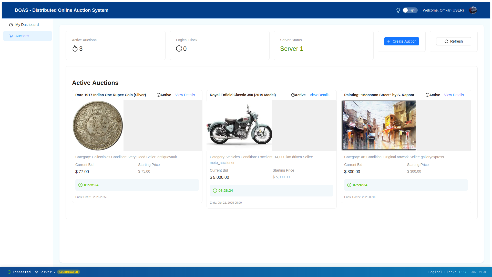
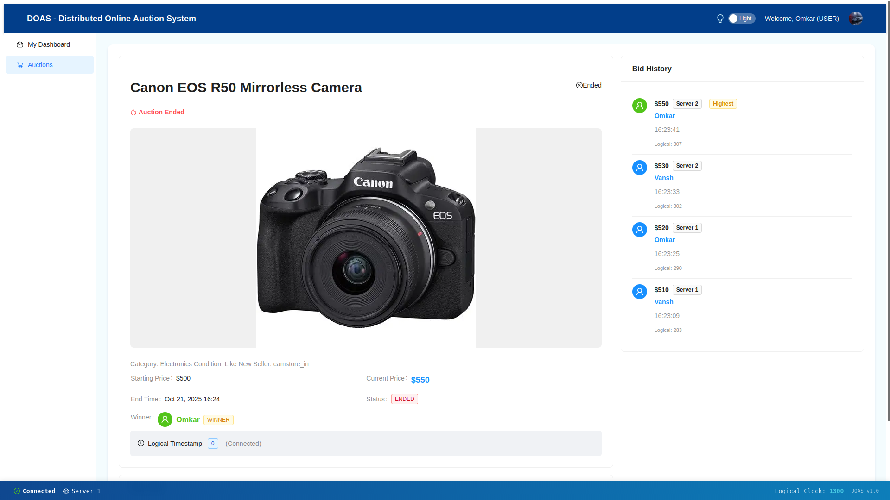
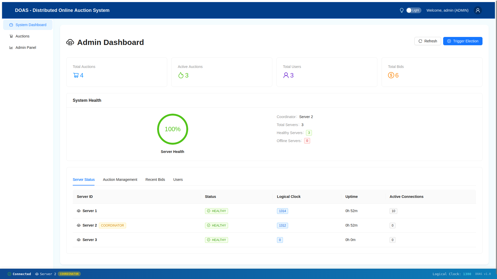

# 🎯 DOAS - Distributed Online Auction System

[](https://openjdk.java.net/)
[](https://spring.io/projects/spring-boot)
[](https://reactjs.org/)
[](https://www.docker.com/)
[](LICENSE)

A comprehensive distributed online auction system implementing core distributed systems concepts including **Java RMI**, **Multithreading**, **Clock Synchronization**, **Leader Election**, **Data Consistency**, and **Load Balancing**.

---

## 📋 Table of Contents

- [Overview](#-overview)
- [System Architecture](#-system-architecture)
- [Core Features](#-core-features)
- [Prerequisites](#-prerequisites)
- [Quick Start](#-quick-start)
- [Project Structure](#-project-structure)
- [Distributed Systems Implementation](#-distributed-systems-implementation)
- [API Documentation](#-api-documentation)
- [Configuration](#-configuration)
- [Scripts & Utilities](#-scripts--utilities)
- [Troubleshooting](#-troubleshooting)
- [Contributing](#-contributing)
- [License](#-license)

---

## 🌟 Overview

DOAS is a production-grade distributed auction system demonstrating the implementation of six core distributed systems requirements:

1. ✅ **Client-Server Communication** using Java RMI
2. ✅ **Multithreading** in distributed environment
3. ✅ **Clock Synchronization** (Lamport Logical Clocks)
4. ✅ **Leader Election** (Bully & Ring Algorithms)
5. ✅ **Data Consistency** (Two-Phase Commit & Replication)
6. ✅ **Load Balancing** (Nginx + Application-level)

### Key Highlights

- 🔄 **Real-time bidding** with WebSocket updates
- 🎨 **Modern UI** with dark/light theme support
- 📊 **Live server monitoring** dashboard
- 🔒 **Distributed locking** for concurrent operations
- 🌐 **Multi-server architecture** with automatic failover
- 📈 **Comprehensive metrics** and health monitoring

---

## 🏗️ System Architecture

```
┌─────────────────────────────────────────────────────────────────┐
│                        NGINX Load Balancer                      │
│                    (Least Connections Algorithm)                │
└────────────────────┬────────────────────────────────────────────┘
                     │
        ┌────────────┼────────────┐
        │            │            │
   ┌────▼───┐   ┌───▼────┐   ┌──▼─────┐
   │Server 1│   │Server 2│   │Server 3│
   │:8081   │◄─►│:8082   │◄─►│:8083   │
   │RMI:1101│   │RMI:1102│   │RMI:1103│
   └────┬───┘   └───┬────┘   └──┬─────┘
        │           │           │
        └───────────┼───────────┘
                    │
        ┌───────────┼───────────┐
        │           │           │
   ┌────▼────┐ ┌───▼─────┐ ┌──▼──────┐
   │PostgreSQL│ │  Redis  │ │ Frontend│
   │  :5432   │ │  :6379  │ │  :80    │
   └──────────┘ └─────────┘ └─────────┘
```

### Components

#### Backend (Spring Boot)
- **3 Server Nodes**: Running on ports 8081-8083
- **Java RMI**: Inter-server communication on ports 1101-1103
- **REST API**: RESTful endpoints for client communication
- **WebSocket**: Real-time bidding updates
- **Spring Data JPA**: Database abstraction layer

#### Frontend (React)
- **Single Page Application**: React 18 with React Router
- **Ant Design UI**: Modern, responsive component library
- **Real-time Updates**: WebSocket integration
- **Theme Support**: Ocean Blue light/dark themes
- **State Management**: React Context API

#### Infrastructure
- **PostgreSQL 15**: Primary data store
- **Redis 7**: Distributed caching and locking
- **Nginx**: Reverse proxy and load balancer
- **Docker Compose**: Multi-container orchestration

---

## 🚀 Core Features

### 1️⃣ Client-Server Communication (Java RMI)

**Implementation**: `DistributedCoordinatorService.java`

```java
// RMI Server Setup
registry = LocateRegistry.createRegistry(rmiPort);
registry.rebind("CoordinatorService", this);

// Remote Method Invocation
public void handleElectionMessage(int senderId, int initiatorId) throws RemoteException {
    lamportClockService.update(timestamp);
    // Process election logic
}
```

**Features**:
- Remote procedure calls between servers
- Heartbeat monitoring every 5 seconds
- Automatic peer discovery and registration
- Fault-tolerant communication with retry logic

---

### 2️⃣ Multithreading Implementation

**Thread-Safe Components**:

```java
// Executor Service for concurrent operations
private final ExecutorService executorService = Executors.newFixedThreadPool(20);

// Thread-safe data structures
private final ConcurrentHashMap<Integer, CoordinatorService> peerServices;
private final AtomicInteger logicalClock;

// Async operations
@Async
public CompletableFuture<Boolean> replicateToServer(String serverId, Operation operation) {
    // Asynchronous replication logic
}
```

**Thread Pools**:
- **Heartbeat Threads**: Monitoring server health
- **Election Threads**: Handling coordinator selection
- **Replication Threads**: Data synchronization
- **API Request Threads**: Processing client requests

---

### 3️⃣ Clock Synchronization (Lamport Logical Clocks)

**Implementation**: `LamportClockService.java`

```java
public class LamportClockService {
    private final AtomicInteger logicalClock = new AtomicInteger(0);
    
    // Increment on local event
    public synchronized int incrementAndGet() {
        return logicalClock.incrementAndGet();
    }
    
    // Update on message receive
    public synchronized void update(int receivedTimestamp) {
        int currentTime = logicalClock.get();
        logicalClock.set(Math.max(currentTime, receivedTimestamp) + 1);
    }
}
```

**Usage**:
- Every bid includes a Lamport timestamp
- Events are causally ordered
- Server health footer displays real-time clock values
- Clock synchronization visible in admin dashboard

---

### 4️⃣ Leader Election Algorithms

#### Bully Election Algorithm

```java
public void startBullyElection(int initiatorId) throws RemoteException {
    List<Integer> higherIdServers = getHigherIdServers();
    
    if (higherIdServers.isEmpty()) {
        becomeCoordinator(); // Highest ID wins
    } else {
        sendElectionMessages(higherIdServers);
        waitForResponses(ELECTION_TIMEOUT);
    }
}
```

#### Ring Election Algorithm

```java
public void startRingElection(int initiatorId) throws RemoteException {
    ElectionToken token = new ElectionToken(serverId, new ArrayList<>(), true);
    token.getParticipants().add(serverId);
    passRingToken(token); // Pass token to next server
}
```

**Features**:
- Automatic coordinator selection (highest server ID)
- Failover when coordinator crashes
- Election status visible in admin dashboard
- Manual election trigger via API

---

### 5️⃣ Data Consistency & Replication

#### Two-Phase Commit Protocol

**Implementation**: `TwoPhaseCommitService.java`

```java
public boolean executeTransaction(String txId, List<Operation> operations) {
    // Phase 1: Prepare
    boolean prepared = preparePhase(txId, operations);
    
    if (prepared) {
        // Phase 2: Commit
        commitPhase(txId);
        return true;
    } else {
        // Abort transaction
        abortPhase(txId);
        return false;
    }
}
```

#### Distributed Locking

```java
// Redis-based distributed lock
public boolean acquireLock(String auctionId, long timeout) {
    String lockKey = "auction:lock:" + auctionId;
    return redisTemplate.opsForValue()
        .setIfAbsent(lockKey, serverId, timeout, TimeUnit.SECONDS);
}
```

**Consistency Features**:
- Atomic auction creation across all servers
- Bid validation with distributed locks
- Data replication with 2PC guarantee
- Race condition prevention

---

### 6️⃣ Load Balancing

#### Nginx Configuration

```nginx
upstream auction_servers {
    least_conn;  # Least connections algorithm
    server auction-server-1:8081 max_fails=3 fail_timeout=30s;
    server auction-server-2:8082 max_fails=3 fail_timeout=30s;
    server auction-server-3:8083 max_fails=3 fail_timeout=30s;
}
```

**Features**:
- **Nginx Level**: Least connections load balancing
- **Application Level**: Round-robin distribution
- **Health Checks**: Automatic server failover (30s timeout)
- **Max Fails**: Remove unhealthy servers after 3 failures
- **Connection Tracking**: Real-time load distribution metrics

---

## 📦 Prerequisites

- **Docker**: 20.10+
- **Docker Compose**: 2.0+
- **Java**: 17+ (for local development)
- **Maven**: 3.8+ (for building backend)
- **Node.js**: 16+ (for building frontend)
- **npm**: 8+ (for frontend dependencies)

---

## ⚡ Quick Start

### 1. Clone the Repository

```bash
git clone https://github.com/whoknows1409/DOAS-DC-Project.git
cd DOAS-DC-Project
```

### 2. Environment Configuration

```bash
# Copy environment template
cp .env.example .env

# Edit .env with your configuration (optional for local testing)
nano .env
```

### 3. Build and Start the System

```bash
# Build and start all services
./manage.sh build
./manage.sh start

# Watch logs
./manage.sh logs
```

### 4. Access the Application

- 🌐 **Frontend**: http://localhost
- 🔐 **Login**: Use default credentials or register a new account
- 👨‍💼 **Admin Dashboard**: http://localhost/admin
- 📊 **API Health**: http://localhost/api/auctions/status

### 5. Test the System

```bash
# Check system status and health
./manage.sh status

# Run detailed health check
./manage.sh health
```

---

## 📁 Project Structure

```
auction-system/
├── backend/                    # Spring Boot backend
│   ├── src/main/java/com/auction/system/
│   │   ├── controller/        # REST API controllers
│   │   ├── model/            # JPA entities
│   │   ├── repository/       # Data repositories
│   │   ├── service/          # Business logic
│   │   │   ├── DistributedCoordinatorService.java  # RMI & Elections
│   │   │   ├── LamportClockService.java           # Logical clocks
│   │   │   ├── TwoPhaseCommitService.java         # 2PC protocol
│   │   │   └── AuctionService.java                # Auction logic
│   │   └── config/           # Spring configuration
│   ├── src/main/resources/
│   │   ├── application.yml   # App configuration
│   │   └── application-docker.yml
│   ├── Dockerfile
│   └── pom.xml               # Maven dependencies
│
├── frontend/                  # React frontend
│   ├── public/
│   ├── src/
│   │   ├── components/       # Reusable components
│   │   │   ├── AuctionSkeleton.js
│   │   │   ├── CountdownTimer.js
│   │   │   ├── EmptyState.js
│   │   │   ├── ServerHealthFooter.js
│   │   │   └── StatusBadge.js
│   │   ├── pages/           # Page components
│   │   │   ├── AuctionList.js
│   │   │   ├── AuctionDetail.js
│   │   │   ├── AdminDashboard.js
│   │   │   ├── Login.js
│   │   │   └── Profile.js
│   │   ├── services/        # API services
│   │   │   ├── api.js
│   │   │   └── websocket.js
│   │   ├── contexts/        # React contexts
│   │   │   └── ThemeContext.js
│   │   ├── hooks/           # Custom hooks
│   │   │   └── useThemeColors.js
│   │   ├── App.js
│   │   └── index.js
│   ├── Dockerfile
│   └── package.json
│
├── nginx/                    # Nginx configuration
│   └── nginx.conf           # Load balancer config
│
├── database/                 # Database initialization
│   └── init.sql             # Schema and seed data
│
├── manage.sh                 # Main management script (start/stop/build/etc.)
│
├── uploads/                  # File uploads directory
│   └── .gitkeep
│
├── docker-compose.yml        # Docker orchestration
├── .env.example             # Environment template
├── .gitignore
├── README.md                # This file
├── DEMO_GUIDE.md            # Demonstration guide
├── DATABASE_COMMANDS.md     # Database operations
└── LICENSE
```

---

## 🔬 Distributed Systems Implementation

### Requirement 1: Client-Server Communication (Java RMI)

**Files**: 
- `backend/src/main/java/com/auction/system/service/DistributedCoordinatorService.java`

**Key Implementation**:
```java
// RMI Registry Setup
registry = LocateRegistry.createRegistry(rmiPort);
registry.rebind("CoordinatorService", this);

// Connect to Peer Servers
for (ServerConfig peer : peerConfigs) {
    Registry peerRegistry = LocateRegistry.getRegistry(peer.host, peer.rmiPort);
    CoordinatorService peerService = (CoordinatorService) peerRegistry.lookup("CoordinatorService");
    peerServices.put(peer.serverId, peerService);
}
```

**Demo**:
```bash
# Check RMI connections
docker logs auction-system-auction-server-1-1 | grep "RMI"

# Expected: "RMI CoordinatorService bound on port 1101"
```

---

### Requirement 2: Multithreading

**Thread Pools**:
```java
// Heartbeat monitoring thread pool
@Scheduled(fixedRate = 5000)
public void monitorHeartbeat() {
    executorService.submit(() -> {
        // Check peer health
    });
}

// Async replication
@Async
public CompletableFuture<Boolean> replicateAuction(Auction auction) {
    // Replicate to all servers
}
```

**Thread-Safe Structures**:
- `ConcurrentHashMap<Integer, CoordinatorService>` for peer services
- `AtomicInteger` for logical clock
- `synchronized` methods for critical sections

---

### Requirement 3: Clock Synchronization

**Lamport Clock Implementation**:
```java
// On local event
int timestamp = lamportClockService.incrementAndGet();

// On message receive
public void receiveMessage(int receivedTimestamp) {
    lamportClockService.update(receivedTimestamp);
}

// Bid with timestamp
Bid bid = new Bid(amount, userId, auctionId);
bid.setLogicalTimestamp(lamportClockService.get());
```

**Visualization**:
- Server health footer shows current clock value
- Admin dashboard displays clock synchronization status
- Each bid includes logical timestamp

---

### Requirement 4: Leader Election Algorithms

**Bully Election Demonstration**:
```bash
# Check current coordinator
curl http://localhost/api/admin/status | jq '.coordinatorId'

# Kill coordinator (Server 3)
docker stop auction-system-auction-server-3-1

# Watch election (Server 2 becomes coordinator)
docker logs auction-system-auction-server-2-1 | grep "election"

# Restart Server 3 (reclaims coordinator role)
docker start auction-system-auction-server-3-1
```

**Ring Election**:
- Token-based election
- Fault-tolerant ring traversal
- Alternative to Bully algorithm

---

### Requirement 5: Data Consistency & Replication

**Two-Phase Commit Flow**:
```
Client Request (Create Auction)
         ↓
    Coordinator
         ↓
    PREPARE → Server 1, Server 2, Server 3
         ↓
    All respond "YES"
         ↓
    COMMIT → Server 1, Server 2, Server 3
         ↓
    Transaction Complete
```

**Distributed Lock Example**:
```java
// Place bid with distributed lock
String lockKey = "auction:lock:" + auctionId;
if (redisTemplate.opsForValue().setIfAbsent(lockKey, serverId, 10, TimeUnit.SECONDS)) {
    try {
        // Process bid (only one server at a time)
        processBid(bid);
    } finally {
        redisTemplate.delete(lockKey);
    }
}
```

---

### Requirement 6: Load Balancing

**Nginx Least Connections**:
```nginx
upstream auction_servers {
    least_conn;  # Distribute to server with fewest active connections
    server auction-server-1:8081;
    server auction-server-2:8082;
    server auction-server-3:8083;
}
```

**Health Check**:
```nginx
server {
    location /api/ {
        proxy_pass http://auction_servers;
        proxy_next_upstream error timeout http_502 http_503 http_504;
    }
}
```

**Demonstration**:
```bash
# Send 10 requests and see distribution
for i in {1..10}; do
  curl -s http://localhost/api/auctions/status | jq '.serverId'
done

# Expected: 1, 2, 3, 1, 2, 3... (round-robin distribution)
```

---

## 📡 API Documentation

### Auction Endpoints

| Method | Endpoint | Description |
|--------|----------|-------------|
| `GET` | `/api/auctions` | List all auctions |
| `GET` | `/api/auctions/active` | List active auctions |
| `GET` | `/api/auctions/{id}` | Get auction details |
| `POST` | `/api/auctions` | Create new auction |
| `POST` | `/api/auctions/{id}/bid` | Place a bid |
| `GET` | `/api/auctions/{id}/bids` | Get bid history |

### Admin Endpoints

| Method | Endpoint | Description |
|--------|----------|-------------|
| `GET` | `/api/admin/status` | System status |
| `GET` | `/api/admin/servers` | Server health |
| `POST` | `/api/admin/election/trigger` | Trigger election |
| `GET` | `/api/auctions/status` | Server info |

### User Endpoints

| Method | Endpoint | Description |
|--------|----------|-------------|
| `POST` | `/api/auth/register` | Register user |
| `POST` | `/api/auth/login` | Login user |
| `GET` | `/api/users/{id}` | Get user profile |
| `PUT` | `/api/users/{id}/profile-image` | Update profile image |

### File Upload Endpoints

| Method | Endpoint | Description |
|--------|----------|-------------|
| `POST` | `/api/files/upload` | Upload file (images) |

---

## ⚙️ Configuration

### Docker Compose Services

```yaml
services:
  auction-server-1:
    ports: ["8081:8081", "1101:1101"]
    environment:
      SERVER_ID: 1
      SERVER_PORT: 8081
      RMI_PORT: 1101

  auction-server-2:
    ports: ["8082:8082", "1102:1102"]
    environment:
      SERVER_ID: 2
      SERVER_PORT: 8082
      RMI_PORT: 1102

  auction-server-3:
    ports: ["8083:8083", "1103:1103"]
    environment:
      SERVER_ID: 3
      SERVER_PORT: 8083
      RMI_PORT: 1103

  postgres:
    ports: ["5432:5432"]
    environment:
      POSTGRES_DB: auctiondb
      POSTGRES_USER: auctionuser
      POSTGRES_PASSWORD: auctionpass

  redis:
    ports: ["6379:6379"]

  nginx:
    ports: ["80:80"]
```

### Application Properties

**Backend** (`application-docker.yml`):
```yaml
spring:
  datasource:
    url: jdbc:postgresql://postgres:5432/auctiondb
    username: auctionuser
    password: auctionpass
  
  redis:
    host: redis
    port: 6379

server:
  port: ${SERVER_PORT:8081}

rmi:
  port: ${RMI_PORT:1101}
  hostname: ${HOSTNAME:localhost}
```

**Frontend** (`src/services/api.js`):
```javascript
const API_BASE_URL = process.env.REACT_APP_API_URL || 'http://localhost';
const WS_URL = process.env.REACT_APP_WS_URL || 'ws://localhost/ws';
```

---

## 🛠️ Scripts & Utilities

### System Management

```bash
# Start the entire system
./manage.sh start

# Build Docker images
./manage.sh build

# Check system status
./manage.sh status

# Run health checks
./manage.sh health

# View logs
./manage.sh logs

# Restart the system
./manage.sh restart

# Stop the system
./manage.sh stop
```

### Database Management

```bash
# Reset database (clear all data)
./manage.sh reset-db

# Clean everything (containers, volumes, build artifacts)
./manage.sh clean
```

### GitHub Upload

```bash
# Upload to GitHub (interactive)
./manage.sh github
```

For complete documentation, see:
- `README.md` - This file
- `GITHUB_UPLOAD_GUIDE.md` - Detailed GitHub upload instructions
- `TROUBLESHOOTING.md` - Common issues and solutions
- `CONTRIBUTING.md` - Contribution guidelines

### Getting Help

```bash
# Show all available commands
./manage.sh help
```

---

## 📸 Screenshots

### Auction Listing


### Live Bidding


### Admin Dashboard


---

## 🎯 Demonstration

To demonstrate the distributed systems features:

1. **RMI Communication:**
   - Check logs: `./manage.sh logs auction-server-1`
   - Look for RMI registration and heartbeat messages

2. **Leader Election:**
   - Stop the coordinator: `docker-compose stop auction-server-1`
   - Watch new leader election in logs

3. **Load Balancing:**
   - Monitor logs from all servers: `./manage.sh logs`
   - Create multiple auctions and see requests distributed

4. **Clock Synchronization:**
   - Check logs for Lamport clock updates during operations

5. **Two-Phase Commit:**
   - Create an auction and observe 2PC logs across servers

---

## 🐛 Troubleshooting

### Common Issues

#### 1. RMI Connection Failures

```bash
# Check if RMI ports are exposed
docker ps | grep auction-server

# Verify network connectivity
docker network inspect auction-system_default

# Check RMI logs
docker logs auction-system-auction-server-1-1 | grep "RMI"
```

#### 2. Database Connection Issues

```bash
# Check PostgreSQL status
docker exec -it auction-system-postgres-1 psql -U auctionuser -d auctiondb -c "\conninfo"

# View connection errors
docker logs auction-system-auction-server-1-1 | grep "database"
```

#### 3. Redis Connection Problems

```bash
# Test Redis connection
docker exec -it auction-system-redis-1 redis-cli PING

# Expected: PONG
```

#### 4. Frontend Not Loading

```bash
# Check Nginx logs
docker logs auction-system-nginx-1

# Rebuild frontend
cd frontend && npm run build
docker-compose restart nginx
```

#### 5. Port Conflicts

```bash
# Check if ports are already in use
sudo lsof -i :80
sudo lsof -i :5432
sudo lsof -i :6379

# Stop conflicting services or change ports in docker-compose.yml
```

### Performance Issues

```bash
# Check container resource usage
docker stats

# Monitor database performance
docker exec -it auction-system-postgres-1 psql -U auctionuser -d auctiondb -c "
  SELECT pid, query, state, wait_event_type
  FROM pg_stat_activity
  WHERE state != 'idle';"

# Check Redis memory usage
docker exec -it auction-system-redis-1 redis-cli INFO memory
```

---

## 👥 Contributing

We welcome contributions! Please see [CONTRIBUTING.md](CONTRIBUTING.md) for guidelines.

### Development Workflow

1. **Fork** the repository
2. **Create** a feature branch (`git checkout -b feature/amazing-feature`)
3. **Commit** your changes (`git commit -m 'Add amazing feature'`)
4. **Push** to the branch (`git push origin feature/amazing-feature`)
5. **Open** a Pull Request

### Code Standards

- **Java**: Follow Google Java Style Guide
- **JavaScript**: Use ESLint with Airbnb config
- **Commits**: Use conventional commit messages
- **Tests**: Add unit tests for new features

---

## 📄 License

This project is licensed under the **MIT License** - see the [LICENSE](LICENSE) file for details.

---

## 🙏 Acknowledgments

- **Spring Boot** team for excellent framework
- **React** team for amazing frontend library
- **Ant Design** for beautiful UI components
- **Docker** for containerization platform
- **PostgreSQL** and **Redis** teams for robust data stores

---

## 📞 Support & Contact

- **GitHub**: [@whoknows1409](https://github.com/whoknows1409)
- **Issues**: [GitHub Issues](https://github.com/whoknows1409/DOAS-DC-Project/issues)

---

## 👤 Author

**Omkar Bhoir**
- GitHub: [@whoknows1409](https://github.com/whoknows1409)
- Project Repository: [DOAS - Distributed Online Auction System](https://github.com/whoknows1409/DOAS-DC-Project)

---

**Built by Omkar Bhoir for Distributed Systems Course**

*Demonstrating real-world implementation of distributed systems concepts*
